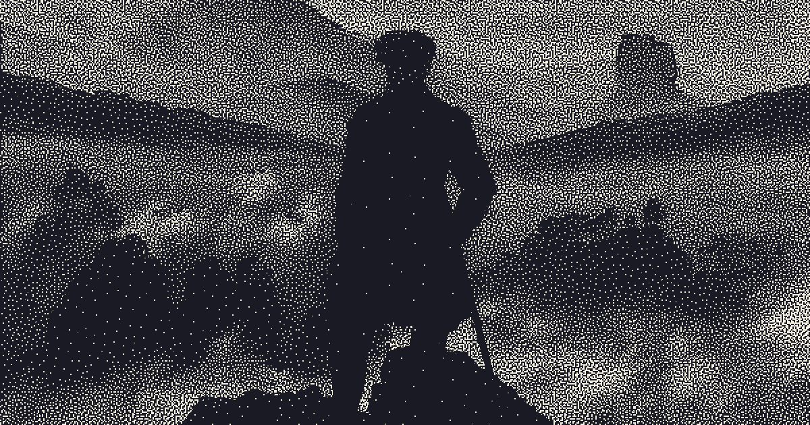

<h1 align="center">I M A G I N E</h1>

Imagine is a simple program that is based almost entirely off of an inktober-inspired shader written by Acerola from youtube. He has an excellent video on it which can be viewed [here](https://youtu.be/E9-LRRDVmo8). Frankly, his video is well made and his results are much better than my own, so I would highly recommend checking out his work.

Above is an example output of the program, after being given an input of the painting *Wanderer above the Sea of Fog* by Caspar David Friedrich. 

As Imagine is a personal project of mine, there is a lot of room for improvement and refinement. In my testing, some images took over six minutes to process. An average image (1000 px x 1500 px) might take around a minute.
